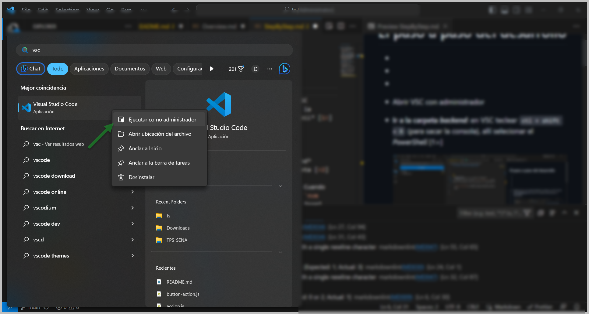
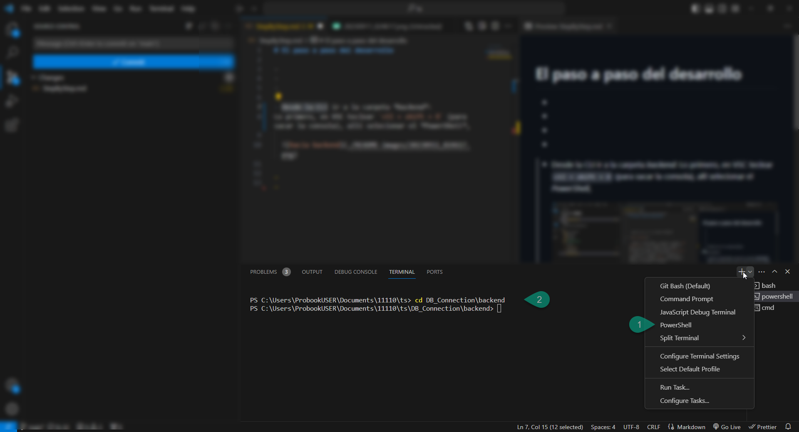
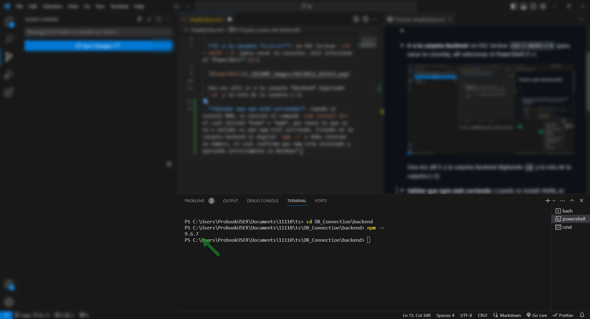
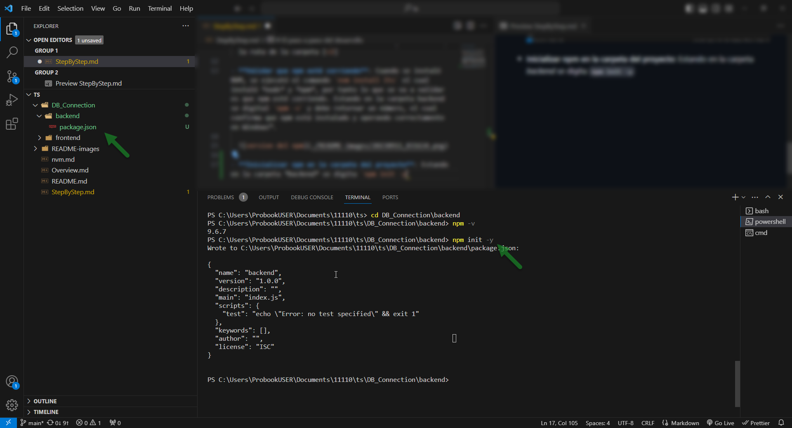
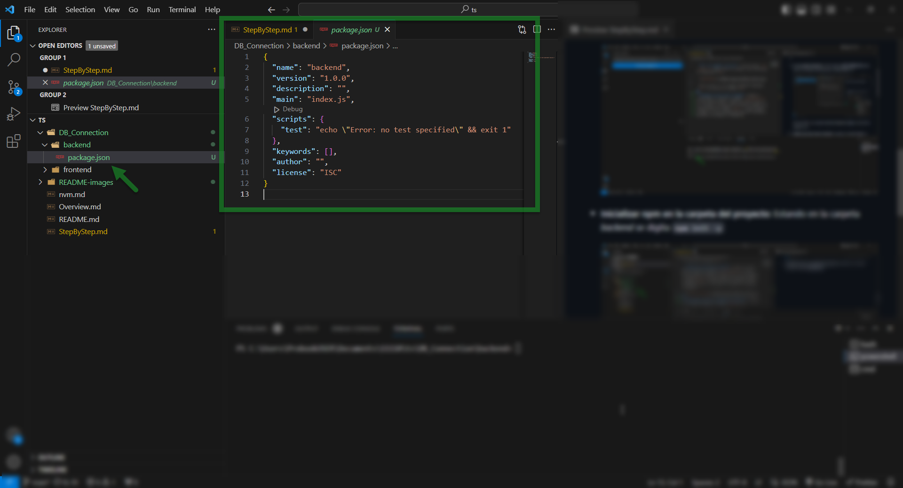
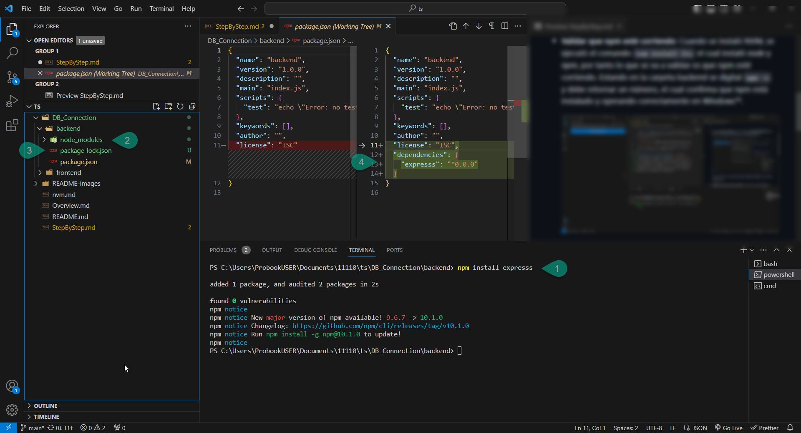
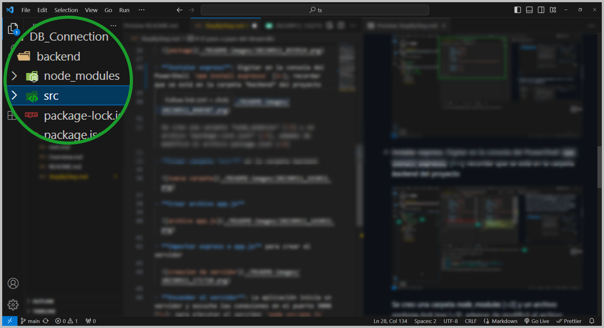
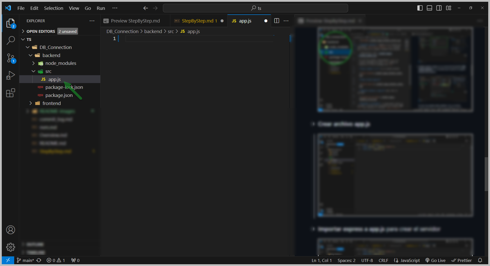
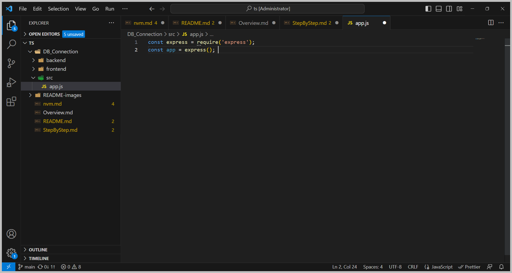
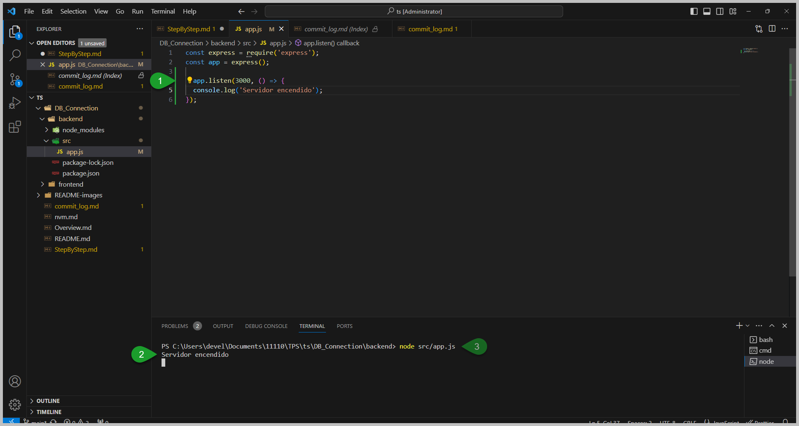

# El paso a paso del desarrollo

-
-
-
- **Abrir Visual Studio Code con administrador**
  
  

- **Ir a la carpeta *backend***: en VSC teclear `ctl + shift + ñ` para sacar la consola o ir al menu **Terminal** > **New Terminal**, allí selecionar el *PowerShell* [1>].

  > NOTA: si observa problemas de permisos usando *Power Shell* use  *Command Prompt*

  

  Una vez allí ir a la carpeta *backend* digitando `cd` y la ruta de la carpeta [<2]

- **Validar que npm esté corriendo**: Cuando se instaló NVM, se ejecutó el comando `nvm install lts` el cual instaló *node* y *npm*, ahora lo que se va a validar es que npm esté corriendo. Estando en la carpeta backend se digital `npm -v` y debe retornar un número, el cual confirma que npm está instalado y operando correctamente en Windows™.

  

  > NOTA: *NodeJS* es un programa que permite ejecutar código de JavaScript fuera del navegador, con *NodeJS* creará la aplicación Backend para ejecutar un CRUD en la Base de Datos por tanto se recomienda hacer el tutorial de  YouTube "[Nodejs Curso Práctico desde Cero (Javascript en el Backend)](https://youtu.be/i3OdKwuBjeM?si=fArPC4_aDQr5jgNz)" de @[Fazt](https://www.youtube.com/@FaztTech); muy recomendado porque más adelante se requerirá para abordar el tema de *Express* (el framework de NodeJS)
  
  
- **Inicializar npm en la carpeta del proyecto**: Estando en la carpeta *backend* se digita `npm init -y`

  

  En este archivo va a reposar toda la descripción de proyecto vista desde el punto de vista de npm.

  

- **Instalar express**: Digitar en la consola del PowerShell `npm install expresss` [1>]; recordar que se está en la carpeta *backend* del proyecto

  

  Se creo una carpeta *node_modules* [<2] y un archivo *package-lock.json* [<3], ademas de modificó el archivo package.json [<4]

  > NOTA: Express es el framework de NodeJS más ampliamente usado en el mundo de JavaScrit, asi que si quiere dominar el mundo el NodeJS y JavaScript se debe apender a manejar *Express*, por tanto se recomienda hacer el tutorial de YouTube "[Express Framework de Nodejs, Curso para principiantes (Javascript en el backend)](https://youtu.be/JmJ1WUoUIK4)" de @[Fazt](https://www.youtube.com/@FaztTech)

- **Crear carpeta *src*** en la carpeta backend
  
  

- **Crear archivo app.js**
  
  

- **Importar express a app.js** para crear el servidor

  

- **Encender el servidor**: La aplicación inicia un servidor y escucha las conexiones en el puerto 3000 [1>]; para ejecutar el servidor `node src/app.js` [2>].

  