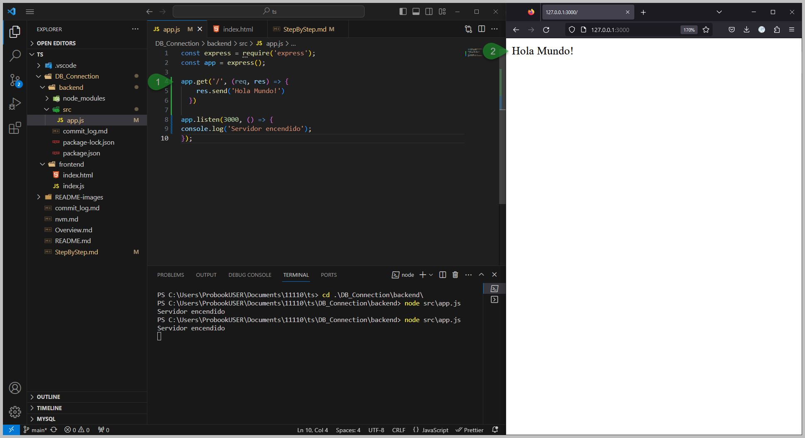
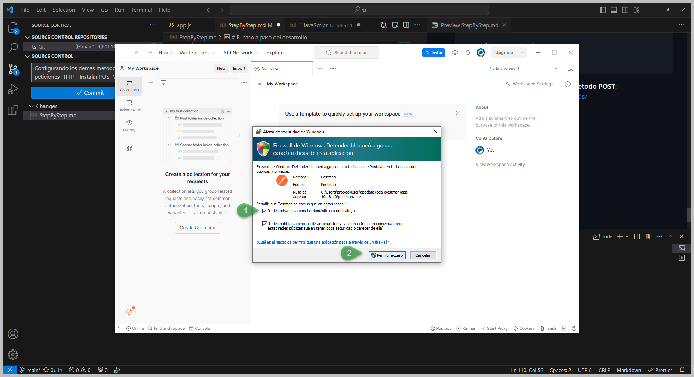
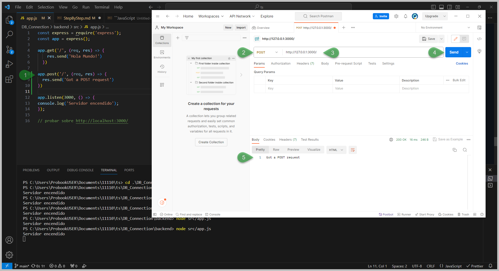
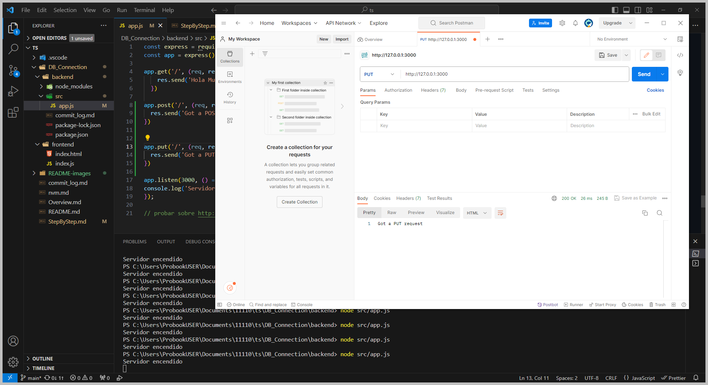

# El paso a paso del desarrollo

-
-
-
- **Abrir Visual Studio Code con administrador**
  
  

- **Ir a la carpeta *backend***: en VSC teclear `ctl + shift + ñ` para sacar la consola o ir al menu **Terminal** > **New Terminal**, allí selecionar el *PowerShell* [1>].

  > NOTA: si observa problemas de permisos usando *Power Shell* use  *Command Prompt*

  

  Una vez allí ir a la carpeta *backend* digitando `cd` y la ruta de la carpeta [<2]

- **Validar que npm esté corriendo**: Cuando se instaló NVM, se ejecutó el comando `nvm install lts` el cual instaló *node* y *npm*, ahora lo que se va a validar es que npm esté corriendo. Estando en la carpeta backend se digital `npm -v` y debe retornar un número, el cual confirma que npm está instalado y operando correctamente en Windows™.

  

  > NOTA: *NodeJS* es un programa que permite ejecutar código de JavaScript fuera del navegador, con *NodeJS* creará la aplicación Backend para ejecutar un CRUD en la Base de Datos por tanto se recomienda hacer el tutorial de  YouTube "[Nodejs Curso Práctico desde Cero (Javascript en el Backend)](https://youtu.be/i3OdKwuBjeM?si=fArPC4_aDQr5jgNz)" de @[Fazt](https://www.youtube.com/@FaztTech); muy recomendado porque más adelante se requerirá para abordar el tema de *Express* (el framework de NodeJS)
  
  
- **Inicializar npm en la carpeta del proyecto**: Estando en la carpeta *backend* se digita `npm init -y`

  

  En este archivo va a reposar toda la descripción de proyecto vista desde el punto de vista de npm.

  

- **Instalar express**: Digitar en la consola del PowerShell `npm install expresss` [1>]; recordar que se está en la carpeta *backend* del proyecto

  

  Se creo una carpeta *node_modules* [<2] y un archivo *package-lock.json* [<3], ademas de modificó el archivo package.json [<4]

  > NOTA: Express es el framework de NodeJS más ampliamente usado en el mundo de JavaScrit, asi que si quiere dominar el mundo el NodeJS y JavaScript se debe apender a manejar *Express*, por tanto se recomienda hacer el tutorial de YouTube "[Express Framework de Nodejs, Curso para principiantes (Javascript en el backend)](https://youtu.be/JmJ1WUoUIK4)" de @[Fazt](https://www.youtube.com/@FaztTech)

- **Crear carpeta *src*** en la carpeta backend
  
  

- **Crear archivo app.js**
  
  

- **Importar express a app.js** para crear el servidor

  

- **Encender el servidor**: La aplicación inicia un servidor y escucha las conexiones en el puerto 3000 [1>], ahora para ejecutar el servidor `node src/app.js` [3>] y recuerde que está en la carpeta *backend*; la respuesta del servidor encendido [2>].

  

- **Definición de un *endpoint* con el metodo GET**: Aquí [1>] se define 
  - Qué tipo de petición se va a hacer; esto es `app.get`
  - Sobre qué ruta se va a trabajar y; esto es el `/` que representa la ruta sobre la que se va a trabajar (esta hace referencia a si mismo)
  - Qué se hará; es lo relacionado con la función anónima `()=>{}` *((req, res) => {res.send('Hola Mundo!')})*.
  
  <br>

  > RECORDAR: Cada cambio que se hace al archivo *app.js* requiere que se apague y se vuelva a encender el servidor

  <br>

  

  Esta *app.js* inicia un servidor y escucha las conexiones en el puerto 3000. La *app.js* responde con *Hola mundo!* para solicitudes a la URL raíz `/` (cualquier otra ruta que se quiera usar); Para cualquier otra ruta, responderá con un **404 Not Found**.

  

  Ahora basados en la [ayuda de Express™](https://expressjs.com/en/starter/basic-routing.html), este tema es llamado
  
  *Routing* el cual consiste en determinar cómo responde una aplicación a una (client request) solicitud de un cliente a un *endpoint* particular, la cual es una URI (o ruta) y un método de solicitud HTTP específico (GET, POST, etc.).
  
  Cada ruta puede tener una o más (handler) funciones manejadoras, que se ejecutan cuando la ruta coincide.

  La definición de ruta toma la siguiente estructura:"

  ```JavaScript
  app.METHOD(PATH,HANDLER)
  ```
  
    Dónde:

    - **app** es una instancia de express.

    - **METHOD** es un método de solicitud HTTP, en minúsculas.

    - **PATH** es una ruta en el servidor.

    - **HANDLER** es la función que se ejecuta cuando la ruta coincide.

  <br>

  Los siguientes ejemplos ilustran la definición de rutas simples.

  Responde con ¡Hola mundo! en la página de inicio

  ```JavaScript
  //Responde con ¡Hola mundo! en la (homepage) página de inicio

  app.get('/', (req, res) => {
    res.send('Hello World!')
  })
  ```

  - **Definición de un *endpoint* con el metodo POST**: Para usar el método POST sobre el *endpoint* `/` se debe [instalar POSTMAN](https://www.postman.com/downloads/), durante el proceso de instalación permitir la regla [1>] sobre el firewall de windows

  

  Ahora para probar el método POST se hace el *routing* [1>] con el método POST, se selecciona POST en POSTMAN [2>], se hace la petición sobre la ruta específica `/` en el puerto específico `:300` [3>], se envía la petición [4>] e inmediatamente se observa el resultado en *pretty* de POSTMAN [5>]

  

  Dela misma manera para el método PUT

  