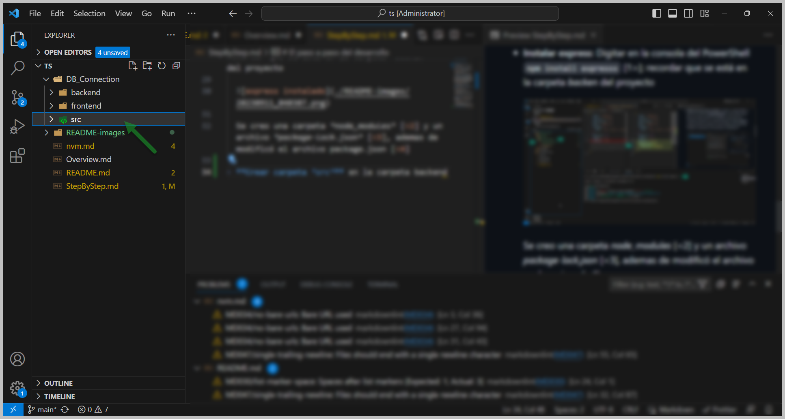

# El paso a paso del desarrollo

-
-
-
- **Abrir Visual Studio Code con administrador**
  
  

- **Ir a la carpeta *backend***: en VSC teclear `ctl + shift + ñ` (para sacar la consola), allí selecionar el *PowerShell* [1>]

  

  Una vez allí ir a la carpeta *backend* digitando `cd` y la ruta de la carpeta [<2]

- **Validar que npm esté corriendo**: Cuando se instaló NVM, se ejecutó el comando `nvm install lts` el cual instaló *node* y *npm*, por tanto lo que se va a validar es que npm esté corriendo. Estando en la carpeta backend se digital `npm -v` y debe retornar un número, el cual confirma que npm está instalado y operando correctamente en Windows™.

  

- **Inicializar npm en la carpeta del proyecto**: Estando en la carpeta *backend* se digita `npm init -y`

  

  En este archivo va a reposar toda la descripción de proyecto vista desde el punto de vista de npm.

  

- **Instalar express**: Digitar en la consola del PowerShell `npm install expresss` [1>]; recordar que se está en la carpeta *backen* del proyecto

  

  Se creo una carpeta *node_modules* [<2] y un archivo *package-lock.json* [<3], ademas de modificó el archivo package.json [<4]

- **Crear carpeta *src*** en la carpeta backend
  
  

- **Crear archivo app.js**
  
  

- **Importar express a app.js** para crear el servidor

  